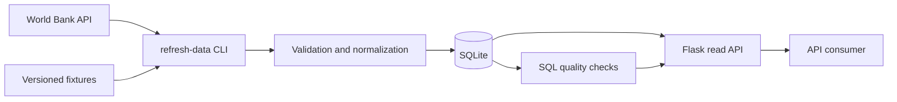

# Flask Country Data API

[](https://github.com/DataTideHH/flask-country-data-api/actions/workflows/ci.yml)
[](https://github.com/DataTideHH/flask-country-data-api/actions/workflows/pages/pages-build-deployment)

[Project site](https://datatidehh.github.io/flask-country-data-api/) · [OpenAPI contract](openapi/openapi.yaml) · [Architecture](docs/architecture.md)

**Reproducible World Bank ingestion workflow with source validation, constrained SQLite persistence, versioned Flask endpoints, SQL data-quality checks, OpenAPI documentation and cross-platform automated tests.**

## Portfolio purpose

This project demonstrates how external reference and indicator data can be turned into a controlled, explainable data service.

The implementation is deliberately focused on the parts that matter in Data/BI and process-oriented work:

- understanding the source contract
- separating ingestion from data delivery
- validating and normalizing source records
- designing a relational model with constraints
- recording process execution and failure states
- exposing stable API responses
- checking persisted data with reviewable SQL
- documenting architecture, lineage and the public API contract

```text
World Bank API or versioned fixtures
→ validation and normalization
→ transactional SQLite persistence
→ SQL data-quality checks
→ versioned Flask read API
```

Normal HTTP requests never call the World Bank directly. Data acquisition is an explicit refresh process, while the API reads the last successfully committed SQLite state.

## Technical evidence

| Area | Evidence in this repository |
|---|---|
| Python / Flask | Application factory, blueprints, CLI command and stable error handlers |
| External APIs | World Bank client with timeout and source-response validation |
| Reproducibility | Version-controlled source-shaped fixtures and deterministic CI |
| Data modelling | Normalized SQLite tables, keys, checks, foreign keys and indexes |
| Process observability | `ingestion_runs` records start, completion, status, row counts and failures |
| SQL / Data quality | Ten named checks executed from `sql/data_quality_queries.sql` |
| API design | Versioned endpoints, bounded parameters and consistent JSON contracts |
| Documentation | OpenAPI 3.1, architecture diagram, ERD, data dictionary, provenance mapping and a compact project site |
| Automated validation | Unit, persistence, route, CLI, quality and validated OpenAPI contract tests on Ubuntu and Windows |

## Architecture



Detailed decisions and component responsibilities are documented in [`docs/architecture.md`](docs/architecture.md).

## Data model

The persisted model contains:

- `countries` — normalized country metadata and record provenance
- `population_observations` — annual `SP.POP.TOTL` observations
- `ingestion_runs` — operational history for refresh executions

See:

- [`sql/schema.sql`](sql/schema.sql)
- [`docs/data-model.md`](docs/data-model.md)
- [`docs/data-dictionary.md`](docs/data-dictionary.md)
- [`docs/data-provenance.md`](docs/data-provenance.md)

## API endpoints

| Endpoint | Purpose |
|---|---|
| `GET /` | Service metadata and endpoint overview |
| `GET /health` | Database availability and basic row counts |
| `GET /api/v1/countries` | List and filter countries |
| `GET /api/v1/countries/<code>` | Read one country with its latest population |
| `GET /api/v1/countries/<code>/population` | Read a population time range |
| `GET /api/v1/summary` | Read dataset-level metrics |
| `GET /api/v1/data-quality` | Execute and report SQL data-quality checks |
| `GET /api/v1/ingestion-runs` | Read recent refresh executions |
| `GET /openapi/openapi.yaml` | Download the OpenAPI 3.1 contract |

Examples:

```text
GET /api/v1/countries?codes=DE,US,JP&limit=10
GET /api/v1/countries?region=North%20America
GET /api/v1/countries/DE
GET /api/v1/countries/DE/population?from=2022&to=2023
GET /api/v1/summary
GET /api/v1/data-quality
GET /api/v1/ingestion-runs?limit=5
```

The complete contract is versioned in [`openapi/openapi.yaml`](openapi/openapi.yaml). CI validates both OpenAPI semantics and coverage of the implemented Flask routes.

## Summary response

```json
{
  "data": {
    "countries": 3,
    "populationObservations": 6,
    "latestObservationYear": 2023,
    "missingPopulationValues": 0,
    "countriesWithoutPopulation": 0,
    "lastSuccessfulIngestion": "2026-07-27T17:00:00+00:00"
  }
}
```

The timestamp above is illustrative. Actual values come from the local database.

## Data-quality reporting

The API executes the named SQL statements in [`sql/data_quality_queries.sql`](sql/data_quality_queries.sql).

Checks cover:

- duplicate and malformed country keys
- missing country names
- invalid coordinates
- duplicate or orphaned population observations
- negative population values
- unexpected indicator codes
- countries without population history
- ingestion runs left incomplete

Example shape:

```json
{
  "data": {
    "status": "passed",
    "errorViolations": 0,
    "warningViolations": 0,
    "checks": [
      {
        "name": "orphan_population_observations",
        "severity": "error",
        "description": "Every population observation must reference an existing country.",
        "violations": 0,
        "passed": true
      }
    ],
    "provenance": {
      "queryFile": "sql/data_quality_queries.sql",
      "lastSuccessfulIngestion": "2026-07-27T17:00:00+00:00"
    }
  }
}
```

See [`docs/data-quality-notes.md`](docs/data-quality-notes.md) for the complete rule set and status logic.

## Stable error contract

```json
{
  "error": {
    "code": "country_not_found",
    "message": "No country was found for code ZZ.",
    "details": {
      "countryCode": "ZZ"
    }
  }
}
```

## Quick start

### Windows PowerShell

```powershell
py -3.12 -m venv .venv
.\.venv\Scripts\Activate.ps1
python -m pip install -r requirements.txt

$env:COUNTRY_API_DATABASE = "instance\country-data.sqlite"
python -m flask --app country_api:create_app refresh-data `
  --codes DE,US,JP `
  --from-year 2022 `
  --to-year 2023 `
  --fixture-dir data\fixtures

python -m flask --app country_api:create_app run --port 8080
```

### macOS / Linux

```bash
/usr/local/bin/python3.12 -m venv .venv
source .venv/bin/activate
python -m pip install -r requirements.txt

export COUNTRY_API_DATABASE="instance/country-data.sqlite"
python -m flask --app country_api:create_app refresh-data \
  --codes DE,US,JP \
  --from-year 2022 \
  --to-year 2023 \
  --fixture-dir data/fixtures

python -m flask --app country_api:create_app run --port 8080
```

The fixture command creates a deterministic local database without network access.

## Live World Bank refresh

Remove `--fixture-dir` to use the live source explicitly:

```bash
python -m flask --app country_api:create_app refresh-data \
  --codes DE,US,JP \
  --from-year 2020 \
  --to-year 2024
```

A failed live refresh is recorded in `ingestion_runs`. Data replacement itself is transactional, so validation or persistence failures do not partially replace the selected country and year range.

## Tests and CI

Install the development requirements:

```powershell
python -m pip install -r requirements-dev.txt
```

Run the same core checks used in CI:

```powershell
python -m compileall -q country_api tests main.py
python -m unittest discover -s tests -p "test_*.py" -v
```

GitHub Actions validates Python 3.12 on Ubuntu and Windows. The workflow:

1. compiles application and test modules
2. runs unit, persistence, route, CLI, data-quality and OpenAPI tests
3. validates the OpenAPI 3.1 document and its coverage of runtime routes
4. builds a deterministic SQLite database from fixtures
5. executes the persisted SQL quality report and requires `passed`

Automated tests never perform live HTTP requests.

## Repository structure

```text
flask-country-data-api/
├── .github/workflows/ci.yml
├── country_api/
├── data/fixtures/
├── docs/
│   ├── _config.yml
│   ├── index.md
│   ├── assets/css/style.scss
│   ├── architecture.md
│   ├── data-dictionary.md
│   ├── data-model.md
│   ├── data-provenance.md
│   └── data-quality-notes.md
├── openapi/openapi.yaml
├── sql/
│   ├── data_quality_queries.sql
│   └── schema.sql
├── tests/
├── main.py
├── requirements-dev.txt
├── requirements.txt
└── README.md
```

## Scope boundary

This is a deliberately bounded portfolio project. It demonstrates controlled ingestion, relational persistence, process observability, data quality and API delivery without adding an unrelated frontend, authentication system, container platform or cloud deployment.
