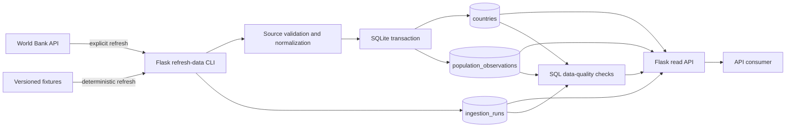

# Architecture

## System context

The project separates data acquisition from API delivery. External source availability therefore does not determine whether read requests can be served.



## Request and ingestion paths

### Ingestion path

```text
refresh-data command
→ World Bank client or fixture client
→ source-shape validation
→ semantic normalization
→ constrained SQLite transaction
→ ingestion status update
```

### Read path

```text
HTTP request
→ query/path validation
→ SQLite read model
→ stable JSON response
```

The read path never performs a live World Bank request.

## Component responsibilities

| Component | Responsibility |
|---|---|
| `country_api/world_bank.py` | Retrieve live or fixture-shaped World Bank responses |
| `country_api/validation.py` | Validate request values and normalize source records |
| `country_api/service.py` | Coordinate refresh runs and ingestion status transitions |
| `country_api/database.py` | Manage transactions, read models, summaries and quality checks |
| `country_api/routes.py` | Expose versioned HTTP endpoints and stable response contracts |
| `sql/schema.sql` | Define relational tables, constraints and indexes |
| `sql/data_quality_queries.sql` | Define named, reviewable data-quality checks |
| `openapi/openapi.yaml` | Describe the public HTTP contract |

## Design decisions

### Explicit refresh instead of source calls in routes

This limits latency variance, avoids coupling API availability to an external service and makes failure states observable through `ingestion_runs`.

### SQLite as a bounded persistence layer

SQLite is appropriate for a small portfolio project because it demonstrates relational modelling, constraints, SQL querying and transactions without adding operational infrastructure that does not support the learning objective.

### Versioned fixtures in automated tests

CI must remain deterministic and must not depend on network access, changing source data or external rate limits. Fixtures preserve the relevant source shape while keeping test expectations stable.

### SQL checks as version-controlled evidence

Data-quality rules are stored in a dedicated SQL file and executed by the application. This keeps quality logic inspectable by both Python and SQL reviewers.

## Scope boundary

The architecture intentionally excludes authentication, a frontend, container orchestration, caching and cloud deployment. Those capabilities would not strengthen the current evidence as much as the implemented focus on controlled ingestion, data modelling, validation, observability and API contracts.
