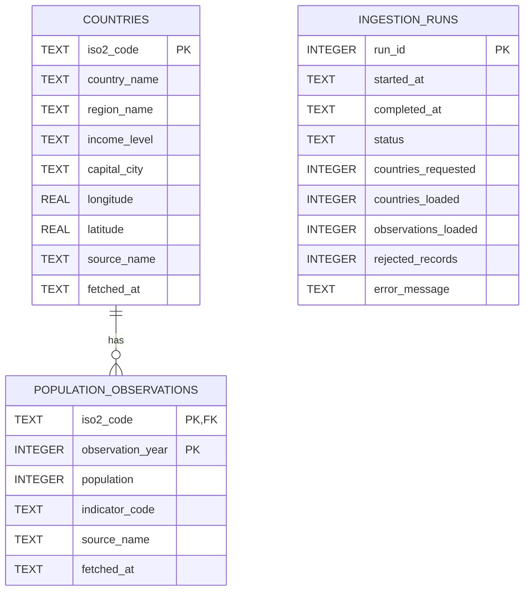

# Data Model

## Entity relationship diagram

`ingestion_runs` is an operational audit table. It records the execution state of refresh operations but is intentionally not used as a foreign-key parent for source rows. Country and population rows retain their own source and retrieval timestamps so their provenance remains available independently of run-history retention.

## Keys and cardinality

- `countries.iso2_code` is the stable country key.
- `population_observations` uses the composite primary key `(iso2_code, observation_year)`.
- One country can have zero or many annual population observations.
- Each observation must reference an existing country.
- One ingestion run represents one invocation of the refresh process.

## Integrity rules

The schema enforces:

- uppercase two-character country keys
- non-empty country names
- valid longitude and latitude ranges
- non-negative or missing population values
- indicator code `SP.POP.TOTL`
- unique country/year observations
- referential integrity between observations and countries
- controlled ingestion statuses: `running`, `success`, `failed`

## Read model

Country API responses combine `countries` with the latest available population observation through a correlated subquery. Population history remains available as a separate time-series endpoint.

The summary and data-quality endpoints aggregate the same persisted tables rather than maintaining separate derived storage.
